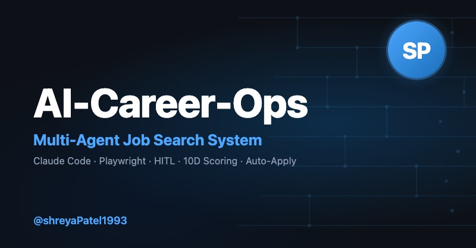

# AI-Career-Operations

<p align="center">
  
</p>

<p align="center">
  <em>Companies use AI to filter candidates. I built AI to help candidates choose companies.</em>
</p>

<p align="center">
  
  
  
</p>

---

<p align="center">
  
</p>

## What Is This

AI-Career-Operations turns Claude Code into a full job search command center. Instead of manually tracking applications in a spreadsheet, you get an AI-powered pipeline that:

- **Evaluates offers** with a structured A-F scoring system (10 weighted dimensions)
- **Generates tailored PDFs** — ATS-optimized CVs customized per job description
- **Scans portals** automatically (Greenhouse, Ashby, Lever, company pages)
- **Auto-fills applications** using stealth Playwright with bot-detection bypass
- **Processes in batch** — evaluate 10+ offers in parallel with sub-agents
- **Tracks everything** in a single source of truth with integrity checks

> **This is NOT a spray-and-pray tool.** AI-Career-Operations is a filter — it helps you find the few offers worth your time out of hundreds. The system strongly recommends against applying to anything scoring below 4.0/5. Your time is valuable, and so is the recruiter's. Always review before submitting.

The system is agentic: Claude Code navigates career pages with Playwright, evaluates fit by reasoning about your CV vs the job description (not keyword matching), and adapts your resume per listing.

> **The first evaluations won't be great.** The system doesn't know you yet. Feed it context — your CV, your career story, your proof points, your preferences. The more you nurture it, the better it gets. Think of it as onboarding a recruiter: the first week they need to learn about you, then they become invaluable.

## Features

| Feature | Description |
|---------|-------------|
| **Auto-Pipeline** | Paste a URL, get a full evaluation + PDF + tracker entry |
| **6-Block Evaluation** | Role summary, CV match, level strategy, comp research, personalization, interview prep (STAR+R) |
| **Interview Story Bank** | Accumulates STAR+Reflection stories across evaluations — master stories that answer any behavioral question |
| **Negotiation Scripts** | Salary negotiation frameworks, geographic discount pushback, competing offer leverage |
| **ATS PDF Generation** | Keyword-injected CVs with Space Grotesk + DM Sans design |
| **Stealth Auto-Apply** | Fills Greenhouse, Lever, Workday, Ashby forms automatically — bypasses bot detection, stops before submit |
| **Jobright Integration** | Fetches curated recommendations from Jobright.ai API with smart age labels (minutes/hours/days) |
| **Portal Scanner** | 45+ companies pre-configured + custom queries across Ashby, Greenhouse, Lever, Wellfound |
| **Batch Processing** | Parallel evaluation with `claude -p` workers |
| **Dashboard TUI** | Terminal UI to browse, filter, and sort your pipeline |
| **Human-in-the-Loop** | AI evaluates and recommends, you decide and act. Never submits without your approval |
| **Pipeline Integrity** | Automated merge, dedup, status normalization, health checks |

## Quick Start

```bash
# 1. Clone and install
git clone https://github.com/shreyaPatel1993/AI-Career-operations.git
cd AI-Career-operations && npm install
npx playwright install chromium   # Required for PDF generation and auto-apply

# 2. Check setup
npm run doctor                     # Validates all prerequisites

# 3. Configure
cp config/profile.example.yml config/profile.yml  # Edit with your details
cp templates/portals.example.yml portals.yml       # Customize companies

# 4. Add your CV
# Create cv.md in the project root with your CV in markdown

# 5. Open Claude Code
claude   # Then ask Claude to adapt the system to you
```

See [docs/SETUP.md](docs/SETUP.md) for the full setup guide.

## Usage

```
/career-ops                → Show all available commands
/career-ops {paste a JD}   → Full auto-pipeline (evaluate + PDF + tracker)
/career-ops scan           → Scan portals for new offers
/career-ops pdf            → Generate ATS-optimized CV
/career-ops batch          → Batch evaluate multiple offers
/career-ops tracker        → View application status
/career-ops apply          → Fill application forms automatically
/career-ops pipeline       → Process pending URLs
/career-ops outreach       → LinkedIn outreach message
/career-ops deep           → Deep company research
/career-ops training       → Evaluate a course/cert
/career-ops project        → Evaluate a portfolio project
```

Or just paste a job URL or description directly — the system auto-detects it and runs the full pipeline.

## How It Works

```
You paste a job URL or description
        │
        ▼
┌──────────────────┐
│  Archetype       │  Classifies role fit against your target archetypes
│  Detection       │
└────────┬─────────┘
         │
┌────────▼─────────┐
│  A-F Evaluation  │  Match, gaps, comp research, STAR stories
│  (reads cv.md)   │
└────────┬─────────┘
         │
    ┌────┼────┐
    ▼    ▼    ▼
 Report  PDF  Tracker
  .md   .pdf   .tsv
```

## Pre-configured Portals

The scanner comes with **45+ companies** ready to scan and **19 search queries** across major job boards:

**AI Labs:** Anthropic, OpenAI, Mistral, Cohere, LangChain, Pinecone
**Voice AI:** ElevenLabs, PolyAI, Parloa, Hume AI, Deepgram, Vapi, Bland AI
**AI Platforms:** Retool, Airtable, Vercel, Temporal, Glean, Arize AI
**Contact Center:** Ada, LivePerson, Sierra, Decagon, Talkdesk, Genesys
**Enterprise:** Salesforce, Twilio, Gong, Dialpad
**LLMOps:** Langfuse, Weights & Biases, Lindy, Cognigy, Speechmatics
**Automation:** n8n, Zapier, Make.com

**Job boards searched:** Ashby, Greenhouse, Lever, Wellfound, Workable, RemoteFront

## Tech Stack


- **Agent**: Claude Code with custom skills and modes
- **PDF**: Playwright + HTML template (Space Grotesk + DM Sans)
- **Auto-Apply**: Playwright stealth with reCAPTCHA handling
- **Scanner**: Playwright + Greenhouse API + WebSearch + Jobright API
- **Dashboard**: Go + Bubble Tea + Lipgloss
- **Data**: Markdown tables + YAML config + TSV batch files

## Project Structure

```
AI-Career-operations/
├── CLAUDE.md                    # Agent instructions
├── cv.md                        # Your CV (create this)
├── config/
│   └── profile.example.yml      # Template for your profile
├── modes/                       # 14 skill modes
│   ├── _shared.md               # Shared context
│   ├── _profile.md              # Your personalizations (never overwritten)
│   ├── evaluate.md              # Offer evaluation
│   ├── pdf.md                   # PDF generation
│   ├── scan.md                  # Portal scanner
│   └── ...
├── templates/
│   ├── cv-template.html         # ATS-optimized CV template
│   ├── portals.example.yml      # Scanner config template
│   └── states.yml               # Canonical statuses
├── stealth-apply.mjs            # Auto-apply bot (Greenhouse, Lever, Workday, Ashby)
├── jobright-fetch.mjs           # Jobright.ai API integration
├── batch/                       # Batch processing scripts
├── dashboard/                   # Go TUI pipeline viewer
├── data/                        # Your tracking data (gitignored)
├── reports/                     # Evaluation reports (gitignored)
├── output/                      # Generated PDFs (gitignored)
└── docs/                        # Setup and architecture docs
```

## About

Built by **Shreya Patel** — Senior Frontend Engineer with 7+ years across Healthcare, Fintech, Automotive, and E-commerce.

This project is a fork and significant extension of [career-ops](https://github.com/santifer/career-ops) by [@santifer](https://github.com/santifer), who originally built it to evaluate 740+ job offers and land a Head of Applied AI role. Full credit to him for the foundational architecture, scoring system, and pipeline design. I've extended it with stealth auto-apply, Jobright API integration, smarter form filling, and personalized it for my own frontend engineering job search.

[](https://portfolio-lemon-rho-euxnt7n9ya.vercel.app/)
[](https://linkedin.com/in/shreya-patel5)
[](https://github.com/shreyaPatel1993)

## Disclaimer

**AI-Career-Operations is a local, open-source tool — NOT a hosted service.** By using this software, you acknowledge:

1. **You control your data.** Your CV, contact info, and personal data stay on your machine and are sent directly to the AI provider you choose. No data is collected or stored by this project.
2. **You control the AI.** The system never auto-submits applications — you always have the final call before anything is sent.
3. **You comply with third-party ToS.** Use this tool in accordance with the Terms of Service of the career portals you interact with. Do not use it to spam employers.
4. **No guarantees.** Evaluations are recommendations, not truth. AI models may hallucinate. The authors are not liable for any employment outcomes.

